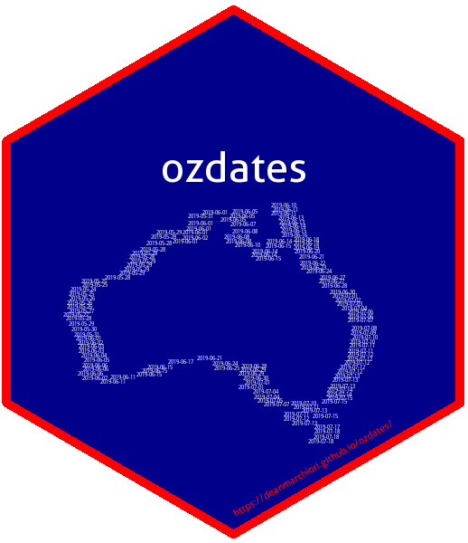

<!-- README.md is generated from README.Rmd. Please edit that file -->

# ozdates 

[](https://travis-ci.org/deanmarchiori/ozdates)


The goal of `ozdates` is to provide tidy historical data of important
Australian dates to help with data analysis.

Current features:

  - `aus_public_holidays`: Australian Public Holidays Dates Machine
    Readable Dataset 2014-2021 - transformed into tidy format. (Source:
    <https://data.gov.au/dataset/australian-holidays-machine-readable-dataset>)

  - `aus_daylight_saving`: Historical start and end time of Australian
    daylight saving time dates according to the Australian Bureau of
    Meteorology. (Source:
    <http://www.bom.gov.au/climate/averages/tables/dst_times.shtml>)

## Installation

You can install the development version of ozdates from
[Github](https://github.com/deanmarchiori/ozdates) with:

``` r
remotes::install_github("deanmarchiori/ozdates")
```

## Examples

Some basic examples:

### Public Holidays

``` r
library(ozdates)
library(dplyr)
library(lubridate)

# What holidays occured in New South Wales in 2018?
nsw_hols <- aus_public_holidays %>% 
  filter(jurisdiction == "NSW",
         year(date) == "2018") %>% 
  select(date, holiday_name, jurisdiction)

nsw_hols
#> # A tibble: 12 x 3
#>    date       holiday_name     jurisdiction
#>    <date>     <chr>            <chr>       
#>  1 2018-01-01 New Year's Day   NSW         
#>  2 2018-01-26 Australia Day    NSW         
#>  3 2018-03-30 Good Friday      NSW         
#>  4 2018-03-31 Easter Saturday  NSW         
#>  5 2018-04-01 Easter Sunday    NSW         
#>  6 2018-04-02 Easter Monday    NSW         
#>  7 2018-04-25 ANZAC Day        NSW         
#>  8 2018-06-11 Queen's Birthday NSW         
#>  9 2018-08-06 Bank Holiday     NSW         
#> 10 2018-10-01 Labour Day       NSW         
#> 11 2018-12-25 Christmas Day    NSW         
#> 12 2018-12-26 Boxing Day       NSW

# Are there any public holidays in the next 2 months?
any(nsw_hols$date %within% interval(ymd("2018-04-01"), ymd("2018-05-30")))
#> [1] TRUE
```

### Daylight Saving Time

``` r
library(ozdates)
library(dplyr)
library(lubridate)

# Which states participate in DST in 2017 and on what dates?
aus_daylight_saving %>% 
  filter(season_start == 2017)
#> # A tibble: 5 x 4
#>   season_start state dst_start_date dst_finish_date
#>          <dbl> <chr> <date>         <date>         
#> 1         2017 TAS   2017-10-01     2018-04-01     
#> 2         2017 VIC   2017-10-01     2018-04-01     
#> 3         2017 ACT   2017-10-01     2018-04-01     
#> 4         2017 NSW   2017-10-01     2018-04-01     
#> 5         2017 SA    2017-10-01     2018-04-01
```

-----

Please note that the ‘ozdates’ project is released with a [Contributor
Code of Conduct](CODE_OF_CONDUCT.md). By contributing to this project,
you agree to abide by its terms.

The use of data in this package must conform with the licence conditions
it was published under. See data documentation for licence and copyright
information.

While care is taken when transforming and representing data. No
responsibility is taken for inaccuracies or loss arising from the use of
this software and data. See the [LICENSE](LICENSE.md) for more
information.
